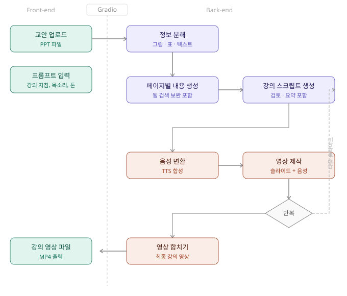
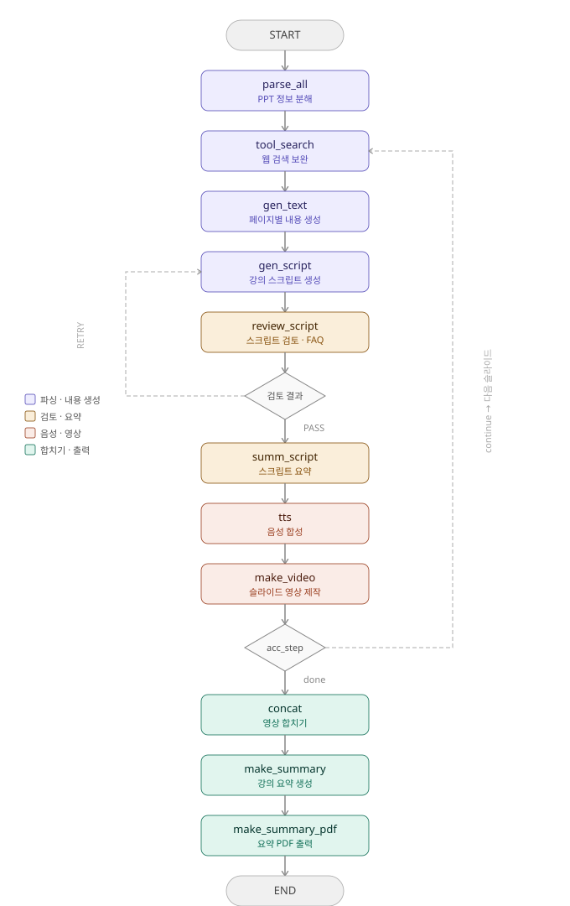

# 🎓 2차 미니 프로젝트
 
> *PPT 파일 하나로 당일 강의 영상을 완성하여, 제작 비용·시간·품질 일관성 문제를 동시에 해결한 기업 교육 콘텐츠 자동화 Agent 프로젝트*
 
---

## 📌 프로젝트 개요
* **수행 기간**: 2026.04.24 ~ 2026.04.28
* **팀 구성**: 👥 팀 프로젝트 / 9인)
* **사용 기술**:
    * `GPT-4o-mini` — 슬라이드별 반복 호출 구조에서 비용 효율성을 확보하면서도 Vision 기능으로 이미지·표까지 분석하기 위해 선택
    * `GPT-4o-mini-tts` — 발표 톤·속도·억양 조절이 가능해 강의 품질을 균일하게 표준화하기 위해 선택
    * `LangGraph` — 파싱 → 검색 → 스크립트 → TTS → 영상으로 이어지는 복잡한 순환 흐름을 노드 그래프로 명확하게 구조화하기 위해 선택
    * `python-pptx` — 슬라이드별 텍스트·표·이미지를 LLM 입력에 맞는 형태로 구조화하여 추출하기 위해 선택
    * `FFmpeg` — 이미지+음성 합성 및 슬라이드별 영상 병합을 크로스플랫폼 환경에서 안정적으로 처리하기 위해 선택
    * `Gradio` — 별도 프론트엔드 개발 없이 PPT 업로드·영상 재생·다운로드 데모 환경을 빠르게 구축하기 위해 선택
* **문제 배경**:
    * 기업 내에서 보고서·발표 자료·신제품 안내 자료 등 다양한 형태의 자료가 지속적으로 생산되지만, 대부분 정적인 PPT·PDF 형태로 활용성이 제한됨
    * 담당자가 직접 녹화·편집·자막 삽입까지 진행해야 해 영상 제작에 최소 수일이 소요됨
    * 발표자마다 톤·스타일이 달라 교육 콘텐츠의 전달력과 품질에 일관성이 부족함
* **비즈니스 요구사항**:
    * PPT 자료만 있으면 별도 작업 없이 당일 교육 영상으로 전환할 수 있는 **즉시성** 확보
    * 영상 편집 인력·외주 없이 내부에서 콘텐츠를 자체 제작할 수 있는 **비용 절감**
    * 발표 톤·길이를 자동으로 조절하여 콘텐츠 **품질을 균일하게 표준화**
* **해결 목표**:
    * PPT 파일을 업로드하는 것만으로 슬라이드 분석 → 스크립트 생성 → 음성 합성 → 영상 제작까지 전 과정을 자동화하는 AI 강사 Agent 구축
    * 사용자 프롬프트(톤·스타일·목소리)로 콘텐츠 품질을 제어할 수 있을 것
    * 슬라이드별 영상을 하나의 완성된 강의 영상으로 자동 합성할 수 있을 것
---

## 🔄 서비스 플로우
 
### 전체 아키텍처 (AI 강사 Agent v2.0)
 

 
### Agent 그래프 구조 (LangGraph StateGraph)

> Step2 고도화 과정에서 QnA 생성, 요약 보고서 PDF 출력 등 기능이 추가되며 초기 아키텍처보다 발전된 구조입니다.
 

 
---

## ✨ 담당 기능
 
### 📂 PPT 정보 분해
슬라이드별 텍스트·표·이미지를 구조화하여 추출하고, 스냅샷 이미지를 생성해 이후 영상 제작의 배경으로 활용
- `python-pptx`로 텍스트 / 표 / 이미지 / 제목 자동 추출

### ✅ 스크립트 품질 검토 & QnA 생성
생성된 스크립트를 자동으로 검토하고, 통과(PASS) / 재생성(RETRY) 분기로 품질을 보장하며 예상 QnA도 함께 생성
- 페이지 내용과 스크립트 비교 검토 후 PASS / RETRY 조건부 분기
- 강의 내용 기반 예상 QnA 자동 생성
---

## 💡 배운 점 및 개선할 점
 
#### ✅ 배운 점
- 각자 기능을 독립적으로 구현한 뒤 합치는 과정에서 노드 간 State 키 불일치 문제를 겪었고, 협업 시 공유 State 구조를 먼저 설계하고 시작하는 것이 중요하다는 점을 배웠다.
- LangGraph의 StateGraph를 활용해 AI Agent를 직접 구현해보면서, 단순 API 호출을 넘어 복잡한 파이프라인을 노드 단위로 설계하고 조건부 분기로 제어하는 흐름을 체득할 수 있었다.
#### 🚀 개선할 점
- 현재는 PPT 파일만 입력으로 지원하고 있어, PDF·Word·Notion 페이지 등 다양한 문서 형식을 입력으로 받아 동일하게 강의 영상을 생성할 수 있도록 입력 형식을 확장할 필요가 있다.
 
---
